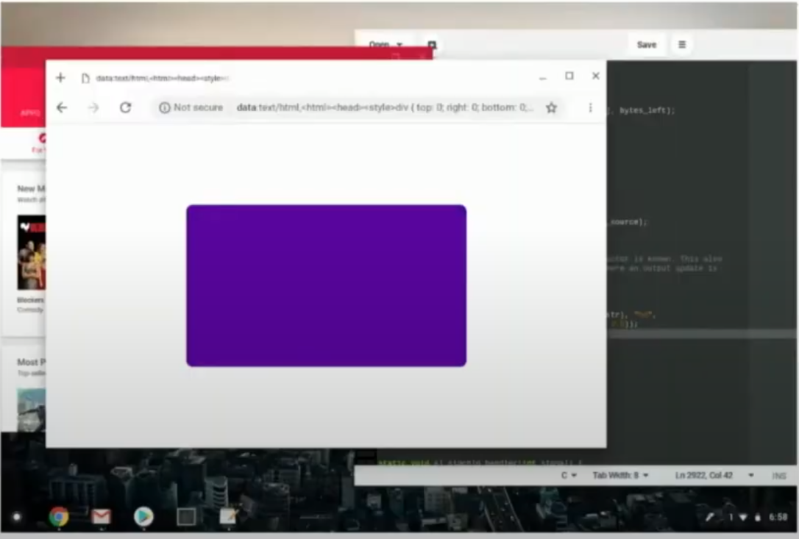
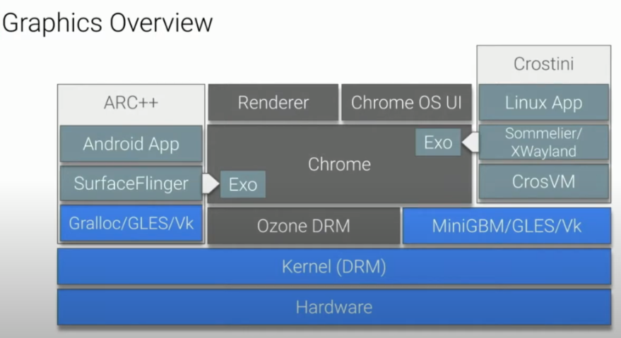
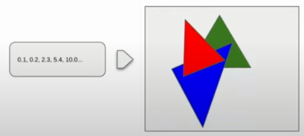
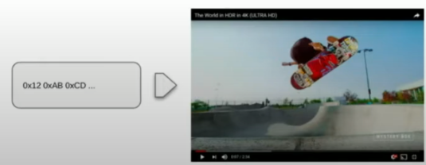
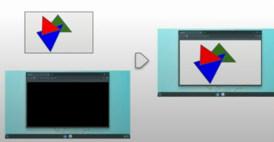

# ChromeOS Graphic Stack 解析  
  本文参考了 **ChromeOS** 开发者在社区上的分享视频：[ChromeOS Graphic 101](https://www.youtube.com/watch?v=aIAGM09lEHY)  
  基于这个视频内容,本文将对整个 **ChormeOS Graphic** 的设计以及运行原理进行一个全面地介绍，并结合四个例子讲述其如何工作。

## 万物伊始：什么是 Graphic
  作为一个拥有可视化界面的操作系统，**ChromeOS** 能够将各种应用以图形化的方式展示在用户面前并允许用户交互：  
    
  在上图所示的界面中，我们能够通过**显示器**看到浏览器，我们的编辑器，以及我们自己的应用 ***同时展示在屏幕上*** ，并且能够通过和其上的 UI 组件交互来使用这些应用及服务。  
  这些功能，就是由 **ChromeOS Graphic** 来实现的。它通过提供图形化的服务来让操作系统实现一个可视化的交互界面。  
  

## ChromeOS Graphic 整体结构
  **ChromeOS** 是 **Chrome** 为了其旗下的笔记本产品 **Chromebook** 所设计的一套操作系统，其中的 **ChromeOS Graphic Stack** 部分负责了显示部分的功能，即像用户提供了可视化的操作界面。整个 **ChromeOS Graphic** 的结构图大致如下:  

  可以看到，整个 **ChromeOS Graphic** 大致可以分为三个部分：

- **Harware(硬件层)**  
  这部分是渲染并展示界面的部分

- **Kernel: DRM**  
  这部分是操作系统内核调用硬件的部分，它通过接受 **Ozone DRM** 的请求来调用硬件执行各种服务

- **Ozone**
  **Ozone** 实际上是一层封装，让应用层的程序通过 **Ozone** 来调用硬件的服务而不是直接通过内核

- **Exo**
  **ChromeOS** Graphic 不仅支持运行 **Chrome** 原生的应用( UI，Chrome 系统自带的应用)，同时也支持运行安卓应用与 Linux 应用，这种能力的实现依靠于 **Exo** 以及 **Wayland** 协议  
  接下来，我们将从底层开始一层一层向上拓展，最终再由几个例子开始自顶向下地梳理 **ChromeOS Graphic** 的工作原理。  

## Hardware 硬件层  
  硬件层由许多图形处理相关的硬件组成，比如我们大家熟知的 **GPU**。通常来说，**Graphic** 硬件层基本上由三个主要的单元组成：  
  - 3D Engine
  - Video Engine
  - Display Engine
  
  接下来我们分别看看这三个部分的功能：  
  ### 3D Engine  

  **3D Engine** 接受一系列对图形的描述，将其展开为像素(pixel)的 **buffer**（即最终传输到显示器上的内容）
    
  从图中可以看到，**3D Engine** 其实是 pixel buffer 的 producer，后续会有其他服务(consumer)使用这些 pixel buffer。  

  ### Video Engine  

  **Video Engine** 接受编码后的视频数据流，将其(即将展示在屏幕上的)帧转换为 **pixel buffer**，这个过程实际上就是视频解码的过程  

    
  
  与 **3D Engine**对比我们可以发现，**Video Engine**同样也是 pixel buffer 的 producer  
  同时，除了能够解码视频，**Video Engine**也支持编码视频，也就是它可以作为 consumer 接受 pixel buffer 作为输入。

  ### Display Engine  

  **Display Engine** 从 buffer 中读取 pixel，并将其显示在屏幕上  
    
  从图中可以看到，**Display Engine** 是一个 consumer，它接受其它 engine 产生的 pixel buffer 并将其显示在屏幕上，在遇到多个应用需要同时显示时，它允许进行 overlay(重叠)以产生一个 pixel 数据显示到屏幕上。  

  ## DRM/KMS