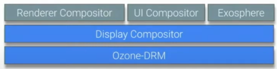

# ChromeOS Graphic Stack 解析  
  本文参考了 **ChromeOS** 开发者在社区上的分享视频：[ChromeOS Graphic 101](https://www.youtube.com/watch?v=aIAGM09lEHY)  
  基于这个视频内容,本文将对整个 **ChormeOS Graphic** 的设计以及运行原理进行一个全面地介绍，并结合四个例子讲述其如何工作。

## 万物伊始：什么是 Graphic
  作为一个拥有可视化界面的操作系统，**ChromeOS** 能够将各种应用以图形化的方式展示在用户面前并允许用户交互：  
    
  在上图所示的界面中，我们能够通过**显示器**看到浏览器，我们的编辑器，以及我们自己的应用 ***同时展示在屏幕上*** ，并且能够通过和其上的 UI 组件交互来使用这些应用及服务。  
  这些功能，就是由 **ChromeOS Graphic** 来实现的。它通过提供图形化的服务来让操作系统实现一个可视化的交互界面。  
  

## ChromeOS Graphic 整体结构
  **ChromeOS** 是 **Chrome** 为了其旗下的笔记本产品 **Chromebook** 所设计的一套操作系统，其中的 **ChromeOS Graphic Stack** 部分负责了显示部分的功能，即像用户提供了可视化的操作界面。整个 **ChromeOS Graphic** 的结构图大致如下:  

  可以看到，整个 **ChromeOS Graphic** 大致可以分为三个部分：

- **Harware(硬件层)**  
  这部分是渲染并展示界面的部分

- **Kernel: DRM**  
  这部分是操作系统内核调用硬件的部分，它通过接受 **Ozone DRM** 的请求来调用硬件执行各种服务

- **Ozone**
  **Ozone** 实际上是一层封装，让应用层的程序通过 **Ozone** 来调用硬件的服务而不是直接通过内核

- **Exo**
  **ChromeOS** Graphic 不仅支持运行 **Chrome** 原生的应用( UI，Chrome 系统自带的应用)，同时也支持运行安卓应用与 Linux 应用，这种能力的实现依靠于 **Exo** 以及 **Wayland** 协议  
  接下来，我们将从底层开始一层一层向上拓展，最终再由几个例子开始自顶向下地梳理 **ChromeOS Graphic** 的工作原理。  

## Hardware 硬件层  

 
  硬件层由许多图形处理相关的硬件组成，比如我们大家熟知的 **GPU**。通常来说，**Graphic** 硬件层基本上由三个主要的单元组成：  
  - 3D Engine
  - Video Engine
  - Display Engine
  
  接下来我们分别看看这三个部分的功能：  
  ### 3D Engine  

  **3D Engine** 接受一系列对图形的描述，将其展开为像素(pixel)的 **buffer**（即最终传输到显示器上的内容）
    
  从图中可以看到，**3D Engine** 其实是 pixel buffer 的 producer，后续会有其他服务(consumer)使用这些 pixel buffer。  

  ### Video Engine  

  **Video Engine** 接受编码后的视频数据流，将其(即将展示在屏幕上的)帧转换为 **pixel buffer**，这个过程实际上就是视频解码的过程  

    
  
  与 **3D Engine**对比我们可以发现，**Video Engine**同样也是 pixel buffer 的 producer  
  同时，除了能够解码视频，**Video Engine**也支持编码视频，也就是它可以作为 consumer 接受 pixel buffer 作为输入。

  ### Display Engine  

  **Display Engine** 从 buffer 中读取 pixel，并将其显示在屏幕上  
    
  从图中可以看到，**Display Engine** 是一个 consumer，它接受其它 engine 产生的 pixel buffer 并将其显示在屏幕上，在遇到多个应用需要同时显示时，它允许进行 overlay(重叠)以产生一个 pixel 数据显示到屏幕上。  

  ### 总结

  从上面的介绍可以看到，硬件层的 **3D Engine** 和 **Video Engine** 负责接受对图形的各种描述，产生 pixel buffer，最终交给 **Display Engine** 来展示在显示器上。 

  ## DRM/KMS

  
  
  接下来让我们来看看 **ChromeOS** 的内核是如何控制硬件层的，即 **DRM（Direct Rendering Manager,直接渲染管理）**
  **DRM** 允许了用户空间（user space）向图形硬件层发送各种请求，其中比较重要的一个部分是 **KMS(Kernal Mode Setting)**，它控制了如何让硬件层去展示 graphic，比如多个页面如何展示在同一个屏幕上。
  **DRM** 有两个主要功能：  

-   **Atomic Display Updates**:
更新屏幕显示设置，**HW overlays**（硬件重叠：指每个要显示的图形都分别在不同的硬件中渲染存储，最终按照顺序直接叠加显示，这样的好处是加快了更细速率，是典型的空间换时间的一种思想。想了解更多请看[这篇博客](https://cashchou.com/2012/12/14/hw-overlay-%E5%B0%8F%E6%AA%94%E6%A1%88/)）设置。**Atmoic** 体现在它能够让多个不同的 graphic 显示在同一个屏幕上（称之为一个 **atomic unit**，宣传的口号是”All or nothing”，关于 **atmoic display** 的文章可以看看这个 [Atomic mode setting design overview](https://lwn.net/Articles/653071/) 。
-   **Buffer Sharing**
这里的 buffer 指的就是前面硬件层提到过的 pixel buffer。通过 **DMABufs** 框架，我们可以将 buffer 抽象为一个文件描述符，从而实现跨进程的 buffer sharing（更多深入了解请看[这篇文档](https://elinux.org/images/a/a8/DMA_Buffer_Sharing-_An_Introduction.pdf)）。此外它也为安卓/Linux 应用提供了共享 Buffer 的支持。
为什么 Buffer Sharing 这么重要？以一个 4K 屏幕为例，一个 buffer 的大小是 32MB，1s 以60个 buffer 计算（60帧）。会发现对内存的占用非常大，最终导致整个 OS 的图形界面看起来非常卡。

### 总结

  可以看到，DRM 封装了底层硬件的细节，并向用户空间提供了直接访问渲染的 API, 所有的 user space 的应用和服务都需要通过 DRM 才能与硬件进行交互。

## User Space Driver

### MiniGBM

  **MiniGBM** 是对 Memory Allocation 的一种抽象，运行在用户空间（user space）中。它为应用程序提供了向 Kernal 申请并管理 graphic buffer 的能力（主要是为了 GPU, video，camera）。比方说我的相机应用希望申请一块buffer用于存储拍到的图像，那么我就可以通过**MiniGBM** 来申请（依靠 **DMABufs** 的能力，**MiniGBM** 在代码层面而不是 IR Code（编译的中间产物）层面支持了 buffer sharing）。
  **MiniGBM** 拥有许多后端，因此能兼容多种硬件平台（Intel，ADM，Rockchip，etc）。
  总而言之，**MiniGBM** 隐藏了硬件平台的实现细节，为应用程序提供了通用的图形缓冲区管理框架。将应用程序与底层的硬件程序解耦，使得跨驱动程序的兼容和移植成为可能。
  [更多了解MiniGBM](https://github.com/intel/minigbm)

### GLES&#x2F;Vulkan Drivers

  GLES(OpenGL ES)和 Vulkan 封装了基本的图形渲染功能。在讲到硬件层的时候我们曾提到，**3D Engine** 可以接受图形的描述作为输入，输出 pixel buffers。这个功能被封装在 GLES/Vulkan 驱动中，我们可以无视硬件细节调用它。即 GLES/Vulkan 封装了硬件的细节，向用户空间的程序提供了一个调用底层硬件的接口。

-   一点点拓展：ChromeOS 中的各种应用如何调用 user space 的 GLE/Vulkan 驱动？

    -   所有 ChromeOS 中应用通过 向**Viz** 进程发起请求来间接调用 user space 的驱动，即每个应用都会向 Viz 进程发送自己的渲染请求，由 Viz 进程去和 user space 的驱动交互并返回结果。这样的设计有两个好处：

        1.  可以保护硬件安全（你也不想你的 GPU 天天被奇怪的 web或者应用直接操作吧）
        2.  在 crash 后可以立刻重启恢复显示

     -   所有 Linux app 以及虚拟机应用 通过类似的名为 **Virgil** 的技术来实现 GPU 的虚拟化。它让 Linux 应用和虚拟机应用以 client 的形式发送渲染请求并接受返回结果。

         -   关于 Virgil
            Virgil 可以使虚拟化环境（如虚拟机）以近似原生性能访问图形硬件。当在 Chromebook 上运行的 Linux 应用程序发出 OpenGL 或 Vulkan API 调用时，virgl 库将 API 调用序列化并转发到 virgl renderer 内核驱动程序提供的虚拟图形适配器。虚拟图形适配器将 API 调用反序列化后转换为可以由主机图形硬件执行的命令，并将结果返回给 virgl 库，后者将其转发给 Linux 应用程序。

    - 所有 Android 应用程序运行在一个容器里，因此可以直接与 user space 的驱动进行交互

        -   为了与 Chrome 原生的应用区分开来，我们有两个调用 GLES/Vulkan 库的 instance ，一个给 ChromeOS 使用，另一个给 Android System 使用（不过官方目前(2020年)正在计划将其迁移到一个虚拟机内，也就是以后 Android 应用可能也是走 Virgil 去和 GLES/Vulkan 交互）

### Ozone

  我们终于可以开始看看属于 Chrome 的一个 user space driver 了。它将所有的 DRM 级别的细节全部隐藏，为上层应用抽象了各种接口使用（比如同步图像，设置显示器，申请内存）。

### 总结

可以看到，user space 层的各种驱动基本都是做了一层 DRM 上的封装，从而让各种平台的应用（Android，Chrome原生，Linux app以及虚拟机应用）能够忽略平台差异控制硬件完成各种渲染需求。

## Chrome 层

  这一层我们将介绍一部分 ChromeOS Graphic 应用层的部分。  

这个东西最初被设计出来是用于合成网页内容的（毕竟 ChromeOS 开发团队的上一个产品是 Chrome 浏览器），现在 ChromeOS 用它来合成 ChromeOS 的 UI。它接受多个 image，然后将其合成为一个 image，最后交由底层渲染并显示在屏幕上。
让我们回忆最初看到的效果图：

 其中有网页，有 Linux 应用，有 Android 应用，Chrome Compositor 将它们各自的 image 合成为了最终我们看到的 image。根据展示效果的不同，有时候 Chrome Compositor 可以直接使用 overlay 将不同的 image 堆叠显示。当遇到比较复杂的展示效果，如失去焦点后的模糊显示时，Chrome Compositor 会使用 OpenGL 来完成效果的渲染。
 通常来说，Overlay 的方式是性能比较好的，因为 GPU 硬件实现这个效果基本上是 0 开销。当你引入 OpenGL 来完成渲染时，会引入一次额外的 buffer copy（想想我们前面提到的 4K 屏的例子）。所以到底是是用 Overlay 方式展示还是使用 OpenGL 渲染额外效果，是一个功能性和性能的取舍。
 当然，现在 Chrome Compositor 正在迁移到 Skia Compositor 的过程中， Skia Compos 基于自己实现的一个 Rendering Library 取代了 OpenGL。它的工作流程和 Chome Compositor 一样：先试试 Overlay 行不行，不行咱就走自己的渲染引擎。

