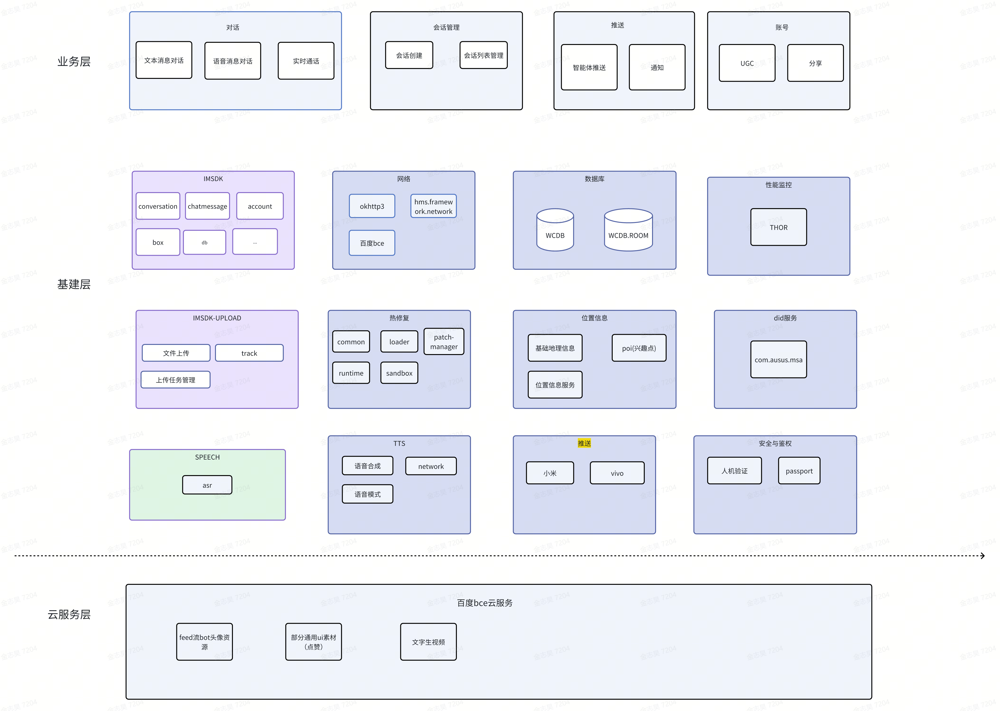
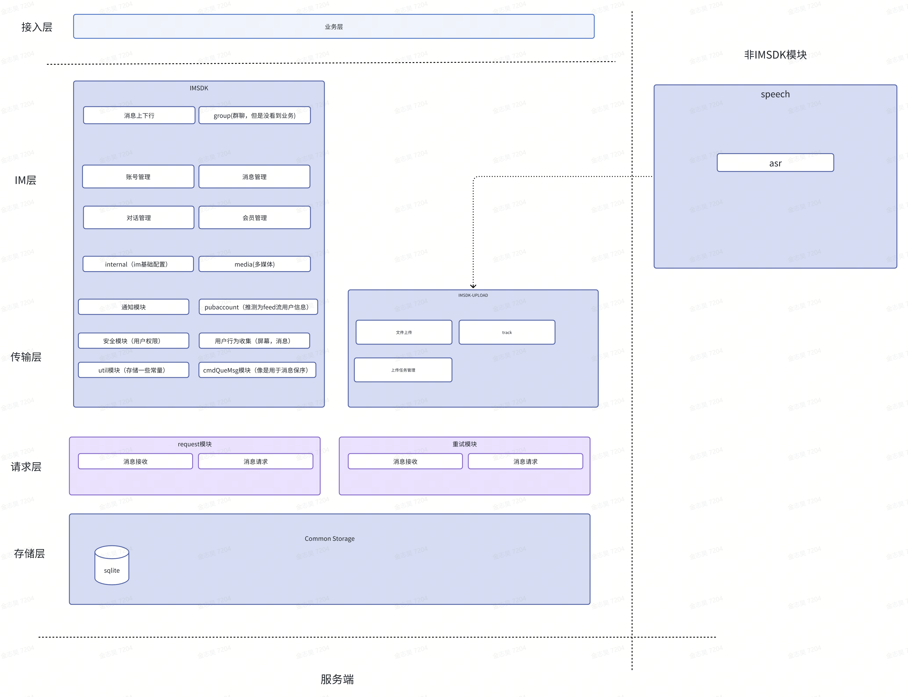
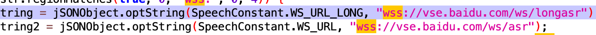
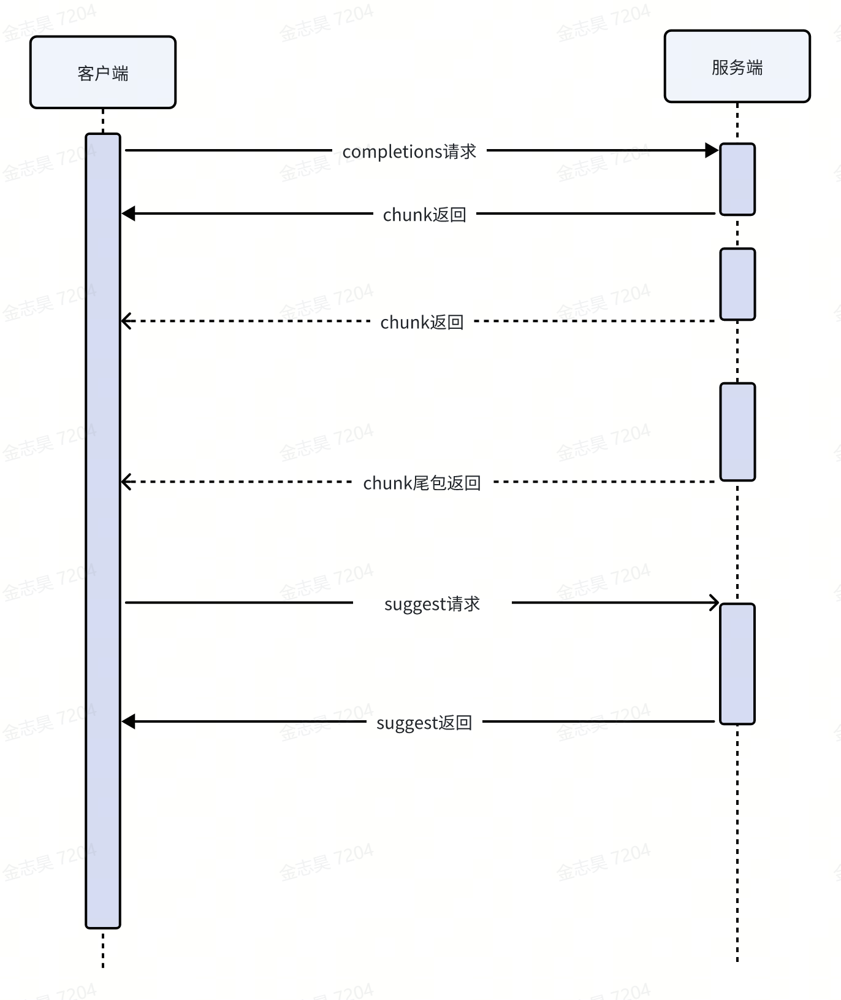

# 文心一言架构调研
当前技术结论基于charles抓包 与反编译结果推测
## 业务场景分析
### 形象
文心的bot的形象动效比较多，交互上在输入侧等用户主动交互的场景会有陪伴动效，体验上更有一种是『人』在听你说话的感觉。
### 对话场景
#### 文本消息对话
文本消息上屏无明显延迟
无断网自动恢复续传
##### 技术推测
使用chunk机制通过短链 `post https://yiyanapp.baidu.com/chat/completions` 来发送消息并拉取回复。
从上屏表现和chunk回复的时序来看，chunk的每包消息到达后就会开始送屏。
断网重试机制上文心使用的是用户主动重试，没有自动重试
#### 文本消息打断
无自动打断能力，只有主动打断入口
##### 技术推测
使用短链` post https://yiyanapp.baidu.com/chat/completionsStop `来主动发起打断，没有自动打断的能力
#### 文本消息建议
suggest 出现的间隔略长
##### 技术推测
使用短链`get https://yiyanapp.baidu.com/api/talk/suggestions `主动拉取suggest prompt，因此会比服务端一次性跟随消息回复下发的方案有明显延时
- 优势：可以用回复作为提问生成suggest，更贴合用户的继续问问题的需求
- 劣势：suggest下行和消息回复到达有间隔
#### 语音消息对话
##### 语音识别，语音播报
语音识别效果正常，语音播报正常，无网状态asr交互被ui拦截，tts自动停止, 按住说话时能实时显示asr结果
###### 技术推测
反编译发现其speech库里的asr和百度的tts模块是有wss 长连接相关的代码的，但是实际测试时没有抓到长连接的包.结合业界大多数asr/tts均使用长连接方案推测其依然是长连接方案
##### 语音消息发送
###### 技术推测
使用短链`post https://yiyanapp.baidu.com/api/audio/upload` 发送录音文件给服务端，返回服务端，使用chunk 拉取服务端回复
#### 上下文管理
##### 技术对比
清除上下文选择了本地更新sectionId, 没有向服务端发出请求，发送消息时会带上sectionid作为参数标记上下文
- 好处：节省了一次请求，因为用户只有在下一次对话的时候才会可能感知到上下文，在下一次发消息时把新的sectionId上传就行
- 问题：多端同步无法保证
#### 实时通话
和语音消息发送同一个链路，非全双工，无法自动打断
全双工会更符合贴合自然对话的场景，但是逻辑设计上会更加复杂
### 发现场景(feed)
#### 发现场景获取
#### 技术推测
app启动时使用短链`https://yiyanapp.baidu.com/api/admin/feed/box` 获取所有推送流的主题和具体bot，对于多tab页这种业务场景来说可以随时线上控制内容，方便做变化和更新
### bot管理
#### 技术推测
通过短链` get https://yiyanapp.baidu.com/api/bot/botlist `获取所有的bot信息
### 搜索场景
文心支持拍照搜索，不过功能上来看更像是集成了百度搜索的sdk的能力。
从用ai强化搜索的逻辑上看，文心的百度进文心有点类似于把现有的同质功能（搜索）集成进来。
## 架构推演
### 结论
文心架构层次偏少，业务层没有分离出业务sdk，以业务层+基建层形式完成架构。
推测原因：快速搭建业务并利用自己成熟的云服务体系完成应用的开发。同时因为没有文心融入其他业务的需求，所以没有对业务层做拆分
参考点：如果要快速搭建起业务的话，尽可能用现有的内部基础服务和云平台的服务，集中人力在业务层的开发上，尽可能少的对依赖的基础服务和云服务做封装
如果要考虑业务后续有可能有迁移需求的话，要对业务层进行一定层次的拆分,最好是将依赖的三方基建sdk以依赖注入的方式进行解耦
### 文心一言架构推测

目前来看文心的app在百度内部的定位还是比较独立的，百度更倾向于将其他自己的产品集成进来（比如他强势的百度搜索）。

### 文心一言IM-SDK架构推测

文心的imsdk比较重，不只是文心使用，可以看到很多文心的依赖库也对imsdk有依赖。并且对于数据库之类的基础库做了自己的实现
文心的imsdk更加偏向一个通用的中台，业务方可以快速接入使用

### module 分析
module功能分析：
1. org.chromium.base: chromium 基础库，推测用于其webview渲染使用
2. com.zui.opendeviceidlibrary: 获取did
3. xiaomi/vivo.push: 小米和vivo的推送sdk
4. com.vivo.identifier:用户认证
5. wcdb/wcdb.room: 数据库
6. com.sina.weibo.sdk：微博sdk
7. com.pixpark.gpupixel: 图片视频渲染库（相机相关功能使用）
8. hms.framework.network.grs/framework：华为网络服务库，grs是获取地区码的
9. hms.framework.common:hms通用库？
10. hms.base.availableupdate/p244ui(混淆了)/device: hms base库
11. com.baidubce:  百度云服务sdk
12. com.baidu.vis.virtual.license: 人机验证sdk
13. com.baidu.titan.sdk.all/pm: 百度的热修复sdk：https://github.com/baidu/titan-hotfix/blob/master/titan-sdk/all/gradle.properties 
14. com.baidu.thor.sdk/common: 百度的性能监控sdk（通过hook和插桩方式监控）
15. com.baidu.strace.perfetto/core: strace库，用于追踪系统行为,其中perfetto用于性能追踪
16. com.baidu.speech: 百度的语音识别sdk，文心的asr，tts播报均做在本地参考链接
17. com.baidu.sofire.utility: 百度的云平台临时授权服务，用于调用百度的bce上的api鉴权用
18. com.baidu.searchbox: 百度搜索sdk,文心有部分搜索功能应该是这里的百度搜索部分,然后就是其『我』tab页明显是百度系页面的ui风格，怀疑也是用的这个sdk
19. com.baidu.sapi2/com.baidu.protect/com.baidu.pass: 百度的passport相关sdk
20. com.baidu.location:百度的位置sdk
21. com.baidu.browser.sailor: 百度浏览器的sdk？可能用于其webview，也可能是百度浏览器进文心
22. com.baidu.android.imsdk: 文心使用的imsdk，应该是一个通用的中台组件，因为推送模块和其他sdk都有依赖此imsdk
23. com.baidu.android.imsdk.upload: imsdk额外的一个upload模块，推测为了多模态提前布局的上传模块
24. com.baidu.android.common.security/net.logging: 通用模块
25. com.asus.msa:文心用的混淆库？
26. okhttp3: 网络库(没有buildconfig，推测为aar方式引入)

## 链路推演
### ASR/TTS链路
asr/tts采用了websocket 长连接, 特点是：
1. 长asr与短asr使用了两条不同的长链

2. asr与tts没有使用同一条长链，tts有独立长链

#### 优势
单个业务场景独自占据一条长链，上下行速度快，不会有并发导致的占用问题。单独的长asr长链推测是专门用于解决长asr问题的长连接（防断连,或许他们的普通asr的长连接保持时间设置的比较短来防止资源占用）
#### 劣势
多条长链资源占用会比较高，或许不适合系统级别的应用使用
### 消息链路

1. 文心的消息问答没有使用长链上行，使用短链chunk机制进行消息的收发。这点行为上和gpt是相同的
2. 没有消息的自动打断机制。断网重试机制在业务中没有体现出自动重试机制，目前来看还是需要主动请求发起重试
3. 文心的suggest prompt 在回复chunk包到达后单独发suggest请求获取，文心做法的优劣在于：
  - 好处：可以用生成的回复的消息去获取suggest prompt，suggest prompt会更能引导用户使用
  - 坏处：suggest的出现会比较慢，在回复消息展示后suggest prompt出现有明显延迟（可以在服务端做优化提在产生完整回复的时候就去向模型获取prompt）

## 分析技巧
### charles抓包
对于很多业务场景如果找不到分析的入口，可以先从网络请求开始分析其交互链路
### charles抓包技巧
对于特定应用的产品，可以用通用域名来筛选，比如文心一言的请求中一定包括baidu或者yiyan字段。根据域名的不同也能大致推断出它的业务的定位。比如文心一言这个app目前来看就是为了推广文心一言模型专用的，所以没有什么自己app独有的域名命名。
### jadx反编译
如果想整体性的看一个应用的架构，推荐使用反编译的手段来大致看看应用的包名
### jadx使用
官方地址+使用说明
### 分析技巧
1. 首先全局搜索BuildConfig去看看它编译了多少个模块，从这里可以大致看出整体架构的拆分
2. 根据BuildConfig中找到的包名，推测模块的功能，对于一些未知的功能，可以直接用包名去网上搜索，有一些组件很可能是开源组件的内部封装版本
3. 分析完所有模块的功能后，结合charles抓包结果，推测整体的架构和交互的链路